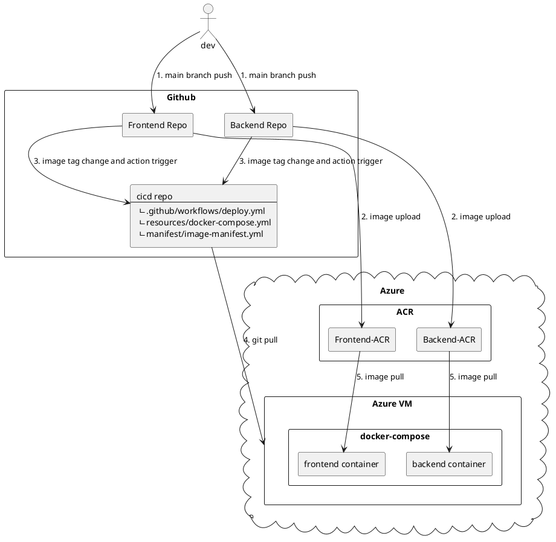

# cicd
CICD 테스트 레포지터리

- [frontend repo](https://github.com/Suah-Cho/frontend) 및 [backend repo](https://github.com/Suah-Cho/backend)
    - 1, 2, 3번 작업이 github actions workflow action으로 실행
- [cicd repo](https://github.com/Suah-Cho/cicd)
    - 4, 5번 작업이 cicd github actions workflow action으로 실행

=> 1, 2, 3번 작업이 프론트엔드와 백엔드 레포지터리에서 각각 실행이 되면 3번 작업(cicd/resources/docker-compose.yml의 이미지 태그 변경)으로 인해 자동으로 cicd github actions이 트리거된다.