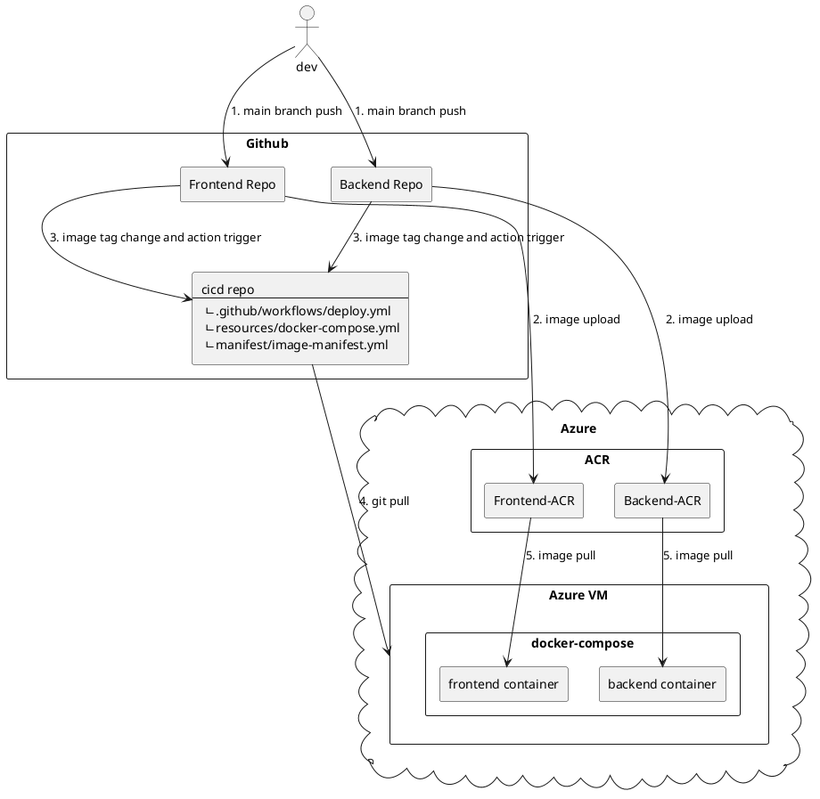
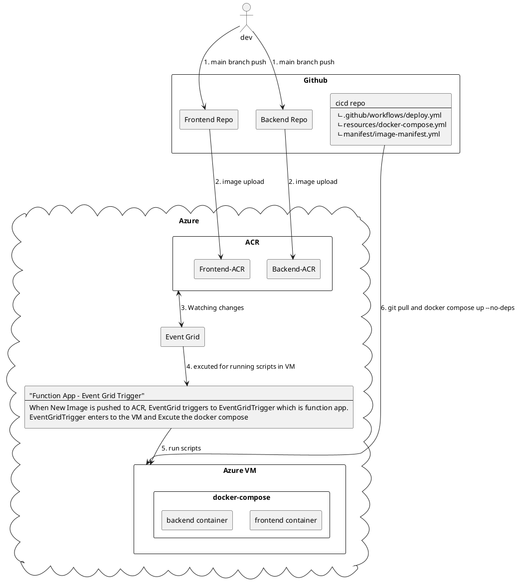
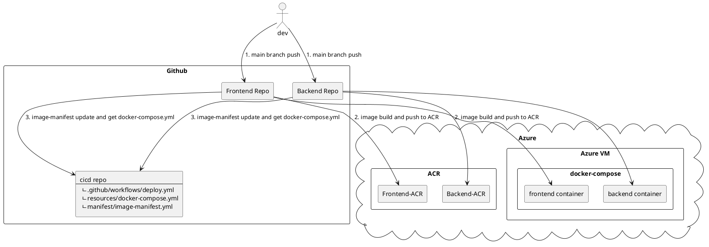

# cicd
CICD 테스트 레포지터리

- 현재 진행 워크플로우

- [frontend repo](https://github.com/Suah-Cho/frontend) 및 [backend repo](https://github.com/Suah-Cho/backend)
    - 1, 2, 3번 작업이 github actions workflow action으로 실행
- [cicd repo](https://github.com/Suah-Cho/cicd)
    - 4, 5번 작업이 cicd github actions workflow action으로 실행

=> 1, 2, 3번 작업이 프론트엔드와 백엔드 레포지터리에서 각각 실행이 되면 3번 작업(cicd/resources/docker-compose.yml의 이미지 태그 변경)으로 인해 자동으로 cicd github actions이 트리거된다.

## Event Grid 사용

- 의문점 :  github Actions만으로 구현하는 것보다 Event Grid를 사용하는 것이 더 효율적인가?

- Event Grid만으로 CD를 진행할 수 없다. CD를 위해 시작점이 되는 것일 뿐. 이 때, Logic App이나 Function App이 중간 다리가 되어야한다. 여기서 의문점은 Logic App의 경우 트리거가 될 때마다 비용이 청구된다. Function App의 경우는 트리거가 하나 더 생성되었다고 비용이 청구되는 것은 아니지만, 현재 Function App에서 오류가 나면 slack으로 알림이 오도록 구현되어 있다. 그럼 CD관련 로그도 Function App의 애플리케이션 오류와 함께 출력이 되는 것이기 때문에, 알림을 받는 데 불편함이 있을 것이라고 생각한다. Function App과 Application Insights를 free plan으로 새로 생성한다고 하더라도 관리 복잡성이 늘어난다. 
- 만약, VM안에 컨테이너가 잘못되어 삭제한 경우, 현재 어떤 이미지를 이용하여 배포하였는지 모를 수 있다. 버전 관리를 하려면 vm내부 스크립트에서 docker compose 이미지 태그를 Event Grid로부터 받은 값으로 변경한 후 commit, push하는 과정이 있어야한다.

## Github Actions 하나만 실행하는 경우

- 하나의 github actions 파일에서 모든 작업을 처리하기 때문에, 간결합니다. 단일 작업으로 처리되기 때문에 두 번의 github actions보다 조금 더 빠를 수 있습니다. 
- 모든 작업이 하나의 파이프라인에 의존하기 때문에, 특정 작업이 실패하면 전체 파이프라인이 중단될 수 있습니다. (문제가 생기면 자동 배포가 중단되는 거기 때문에 중단되었을 때의 문제점은 모르겠습니다.)

=> GPT 4o의 의견으로는 두 번의 Github Actions를 이용하는 것을 추천했습니다. 두 번의 Github Actions를 이용하는 것이 유연성(각각의 파이프라인을 독립적으로 관리하고 개선할 수 있다.), 확장성(프로젝트가 커짐에 따라 각 파이프라인을 개별적으로 확장할 수 있다.), 안정성(CI이후 CD 작업을 실행하므로, 더 안정적인 배포 프로세스를 유지할 수 있다.)등 장점을 가지고 있습니다. 팀의 규모가 작고 프로세스가 비교적 단순하다면, 단일 파이프라인으로 관리하는 것이 더 효율적일 수 있습니다. 